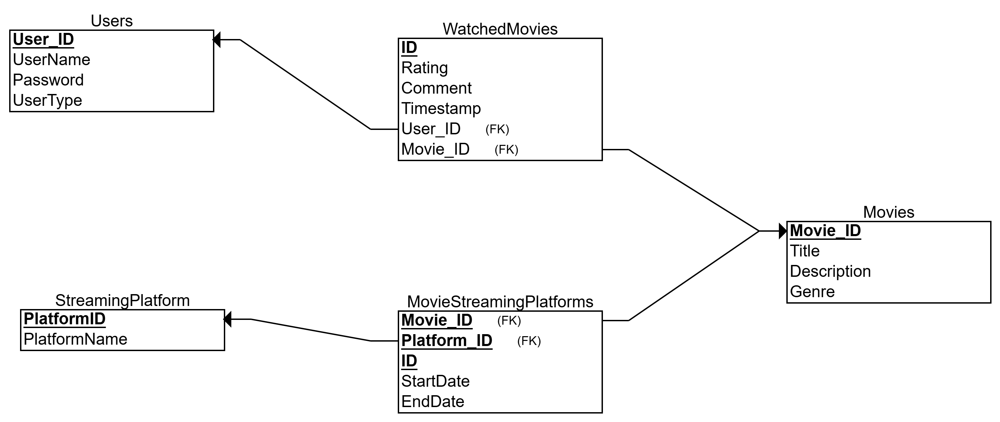

# Project Title
## **Movie Streaming Platform**
#### Group Members
- Thiru Vanitha Rani Veluchamy
- Hemamalini Venkatesh Vaneth

##### Narrative

This project is a web-based movie streaming platform application designed to allow users to discover and explore movies across various streaming services (e.g., Amazon Prime, Netflix, Disney+). Users can register for an account, login, and browse movies based on their availability on different platforms. The application also incorporates user ratings and comments to provide valuable insights into popular choices and community feedback.

##### Primary Use Cases

- **User Registration and Login**: Allows users to create new accounts or login to existing accounts.
- **Admin Dashboard:**
    - CRUD Operations on Movies: Manage movie entries including adding, editing, deleting, and viewing movie information (name, description, genre).
    - Assign Movies to Streaming Platforms: Link movies to specific streaming platforms where they are available.
    - View User Count: View the total number of users including usernames and user types.
- **User Dashboard:**
    - Browse Movies: View available movies with details including streaming platform, start date, end date, description, genre, and average rating.
    - Rate Movies: Users can rate movies on a scale (likely to be implemented).
    - Comment on Movies: Users can leave comments on movies (likely to be implemented).
    - View Watched Movies List: See a list of movies the user has watched.
    - View Trending Movies: See a list of the most popular movies rated by users in the last 7 days.
##### User Roles
- **Admin**: Manages the application, including adding and managing movies, assigning movies to streaming platforms, and viewing user information.
- **User**: Discovers and watches movies, rates movies (to be implemented), comments on     movies (to be implemented), and views watched and trending movies.
- Implement movie rating functionality for users.
- Implement movie commenting functionality for users.
- Develop a search function to allow users to search for movies by title or genre.
- Integrate user authentication for a more secure login process.
- Develop a recommendation system to suggest movies to users based on their watch history and ratings.
- Design a responsive web interface to ensure the application is accessible on different devices.
- Deploy the application to a web server to make it publicly accessible.

## Technology Stack
- Programming Language: Python
- Framework: Flask
- Database: MySQL
- Templating Engine: Jinja2 (likely used by Flask)
- Additional Libraries (potential based on code):
- pymysql (MySQL database connector)
- yaml (for reading configuration files)
- Flask-Session (for session management - not explicitly used in provided code)
- datetime (for handling dates and timestamps)
## User Roles and Functionality
#### Admin
- Manages the application, including:
    - CRUD Operations on Movies: Add, edit, delete, and view movie information (name, description, genre).
    - Assign Movies to Streaming Platforms: Link movies to specific streaming services where they are available.
- View User Count: See the total number of users, including usernames and user types.
- Uses secure login credentials (hashed password).

#### User
- Discovers and explores movies:
    - Browse movies with details including streaming platform, start date, end date, description, genre, and average rating.
    - View trending movies based on recent ratings and comments in the last week.
    - Provides feedback on movies:
    - Rate movies on a scale to express their opinion.
    - Leave comments on movies to share their thoughts.
## Database Design
#### Tables:
- Users: Stores user information (UserID, UserName, Password, UserType)
- Movies: Stores movie details (MovieID, Title, Description, Genre)
- StreamingPlatforms: Lists available streaming platforms (PlatformID, PlatformName)
- MovieStreamingPlatforms (many-to-many relationship): Links movies with streaming platforms, including availability dates (MovieID, PlatformID, StartDate, EndDate)
- WatchedMovies: Records user ratings and comments for movies (UserID, MovieID, Rating, Comment, Timestamp)
#### Relationships:
- A User can watch many Movies (one-to-many)
- A Movie can be watched by many Users (one-to-many)
- A Movie can be available on many StreamingPlatforms (many-to-many)
- A StreamingPlatform can have many Movies (many-to-many)
 
 

## Installation and Setup Instructions
basic Python and MySQL environment setup/VS code

#### Configure database connection:
- Create a MySQL database and user with appropriate permissions.
- Edit the configuration file (config.yaml) to specify database connection details like hostname, username, password, and database name.

## **Running the Application**
- Start the development server:
    python app.py
This will typically run the application on http://localhost:5000/ (default port for Flask development server). You may need to adjust the port number if it's already in use.
## **Future Work**
- Implement a more robust recommendation system to suggest movies to users based on their preferences and watch history, leveraging ratings and comments.
- Enhance the user interface for a more intuitive and visually appealing experience.
- Explore integrating with social media platforms to allow users to share their movie experiences.
- Consider adding features like watchlists and personalized recommendations.
- Deploy the application to a cloud platform (e.g., Heroku, AWS) for scalability and accessibility.
- Implement error handling and user feedback mechanisms to improve user experience.
- Secure the application further by considering additional security measures like input validation, session.

## **config.example.py** 
**Explanation:**
- db: (Dictionary): This section defines the configuration details for connecting to your MySQL database.
- host (String): Specifies the hostname or IP address of your MySQL server. In this example, it's set to 'mysql.example.org'. Replace this with your actual hostname or IP address.
- user (String): Defines the username for connecting to the MySQL database. Here, it's set to 'sample_user'. Replace it with the username you created for your application.
- password (String): Contains the password for the specified user. In this case, it's set to 'SamplePassword'. Replace it with the actual password you assigned to the user.
- db (String): Indicates the name of the database you created for the Movie Streaming Platform application. Here, it's set to 'MovieStreaming'. Make sure the database name you use matches the one you created.
- port (Integer): Defines the port number on which your MySQL server is listening for connections. The default port for MySQL is 3306, and it's used here unless you've configured your server to use a different port.
  
#### **How to Use:**
- Rename the file from config.example.py to config.py. This indicates that it's the actual configuration file being used.
- Update the values of host, user, password, and db to match your specific MySQL database setup.
- Make sure you don't commit the config.py file to your version control system (e.g., Git) as it contains sensitive information like passwords.
#### Additional Notes:
- Consider using environment variables to store your database credentials instead of directly embedding them in the configuration file. This enhances security and makes it easier to manage credentials for different environments (development, testing, production).
- Use a library like python-dotenv to manage environment variables in your Python application.
- By following these steps and considerations, you can effectively configure your application to connect to the MySQL database and leverage the db_utils.py functions to manage user accounts, movies, streaming platforms, and user interactions.
- 
## **Base Template (base.html)**
This is a common layout template that likely contains the basic HTML structure, navigation bar, header, footer, and CSS styles. It's used to provide a consistent look and feel across all pages of the application.

## **Admin Dashboard Template (admin_dashboard.html)**
This template extends the base template and adds specific content for the admin dashboard. It consists of the following sections:
- Manage Movies:
    - A form to add new movies, including fields for title, description, and genre.
    - A list of existing movies, with options to update or delete each movie.
- Assign Movie to Streaming Platform:
    - A form to assign a movie to a streaming platform, including dropdowns for selecting the movie and platform, as well as fields for start and end dates.
- Current Movies:
    - A table displaying all movies, including title, description, genre, and action buttons for updating or deleting each movie.
- Registered Users:
    - Displays the total number of registered users.
    - A table listing user IDs, usernames, and user roles.
## Key Points:
**Template Inheritance:** The extends tag in admin_dashboard.html inherits the structure and styles from the base template.
- Form Handling: The forms in the template are likely handled by the Flask application's routes, where the submitted data is processed and used to update the database.
- Dynamic Content: The for loops in the template iterate over the movies and platforms lists to dynamically generate the table rows and form options.
- URL Endpoints: The href attributes in the update and delete links point to specific URL endpoints defined in the Flask application's routes.
- **Bootstrap:** The use of Bootstrap classes (e.g., form-control, btn) provides a responsive and visually appealing layout.
#### Additional Considerations:
- Security: Ensure proper input validation and sanitization to prevent security vulnerabilities like SQL injection and cross-site scripting (XSS).
- Error Handling: Implement error handling mechanisms to display informative messages to the user in case of issues.
- User Experience: Consider adding features like search functionality, pagination for large datasets, and sorting options to enhance the user experience.
  
By understanding the structure and components of this template, you can customize and extend it to meet the specific needs of your movie streaming platform application.

## Base Template (base.html)
As mentioned earlier, this is the foundation template that provides the overall structure and styling for all pages. It likely includes elements like the header, navigation bar, footer, and any global CSS styles.

#### User Dashboard Template (user_dashboard.html)
This template extends the base template and displays the following:
- **Available Movies:**
- A table listing movies, including:
- Title
- Description
- Genre
- Streaming Platform
- Start Date
- End Date
- Average Rating (rounded to 2 decimal places using the round filter)
- An "Rate" button that links to the rate_movie route for the specific movie.
#### Navigation Links:
- A button to view the user's watched movies list.
- A button to view the trending movies.
#### Key Points:
- Template Inheritance: The extends tag inherits the structure and styles from the base template.
- Dynamic Content: The for loop iterates over the movies list to dynamically generate the table rows.
- URL Endpoints: The "Rate" button links to the /user/rate/<movie_id> route, where <movie_id> is the ID of the specific movie.
- Filters: The round(2) filter is used to round the average rating to 2 decimal places.
- Bootstrap: Bootstrap classes are used to provide a responsive and visually appealing layout.
**Additional Considerations:**
- Error Handling: Implement error handling mechanisms to display informative messages to the user in case of issues, such as when a movie is not found or when there's a problem fetching data.
- User Experience: Consider adding features like search functionality, filtering options, and sorting capabilities to enhance the user's ability to find and explore movies.
- Accessibility: Ensure the template is accessible to users with disabilities by following accessibility guidelines (e.g., using appropriate HTML semantic elements, providing alternative text for images, and using keyboard navigation).
- Security: Implement appropriate security measures to protect user data and prevent unauthorized access.
By understanding the structure and components of this template, you can customize and extend it to meet the specific needs of your movie streaming platform application.

**HTML Structure:**
- Defines the basic HTML document structure with <!DOCTYPE html>, <html>, <head>, <body>, and closing tags.
- Sets the character encoding to UTF-8 for proper display of characters.
- Includes a viewport meta tag to ensure responsive layout across different devices.
- Sets the page title to "Movie Streaming Platform" using the <title> tag.
**Bootstrap Integration:**
- Navigation Bar:
    - Uses the Bootstrap navbar component to create a navigation bar at the top.
    - Includes the application logo (Movie Platform) as the brand name using <a class="navbar-brand">.
    - Utilizes a collapsible navbar (navbar-collapse) for smaller screens.
    - Conditionally displays user-specific navigation links:
    - If a username is present in the session (session.get('username')), it displays a welcome message and a logout link.
    - If no username is found, it displays login and register links.
**Content Container:**
- Defines a container element (div) with the container class from Bootstrap for better layout and responsiveness.
- Includes a space for displaying flash messages using Jinja2 templating features.
-Defines a content block () that serves as a placeholder for content specific to each page. This block will be overridden by individual templates that inherit from base.html.
**Key Points:**
- Base Template for Inheritance: This template serves as the foundation for all other templates in your application, providing a consistent layout and navigation structure.
- Flash Messages: The template leverages Flask's flash messaging system to display temporary messages (e.g., login success, registration confirmation) to the user.
- Session-based Login Detection: The template checks for a username in the session to determine whether to display user-specific navigation links or login/register options.
**Additional Considerations:**
- Customization: You can customize the navigation bar by adding additional links or styling options to match your application's design.
- Footer: Consider adding a footer section to the base template for displaying copyright information, contact details, or social media links.
- Error Handling: You might want to include a dedicated block or mechanism in the base template to display error messages or handle exceptions gracefully.
By understanding the structure and components of this base template, you can effectively extend it to create custom page layouts for different sections of your movie streaming platform application.
Base Template (base.html)
As previously discussed, this is the foundational template that provides the overall structure and styling for all pages. It includes the navigation bar, content container, and flash message handling.
#### Login Template (login.html)

Explanation:
This template extends the base template and adds the following content:
        - Login Form:
	          - A form with two fields:
	               - Username: A text input field for the user's username.
	               - Password: A password input field for the user's password.
	               - A submit button to submit the form.
        - Registration Link:
	          - A hyperlink to the registration page (/register) with the text "Don't have an account? Register here".

                   Key Points:
                         - Template Inheritance: The extends tag inherits the structure and styles from the base template.
                         - Form Handling: The form is likely handled by a Flask route that processes the submitted credentials, validates them, and redirects the user to the appropriate dashboard (admin or user).
                   Security Considerations:
                         - Password Hashing: The password should be hashed before storing it in the database to enhance security.
                         - Input Validation: Implement input validation to prevent malicious input.
                         - Session Management: Use Flask's session management to store user information after successful login.
                   Additional Considerations:
                         - Error Handling: Display error messages to the user if the login credentials are invalid.
                         - User Experience: Consider adding features like password reset functionality and account recovery options.
                         - Security: Implement appropriate security measures to protect user data and prevent unauthorized access.

By understanding the structure and components of this template, you can customize it to meet your specific login requirements and enhance the user experience.

#### Platform.html

Explanation:
This template displays a list of existing streaming platforms and provides options to update or delete them. It also includes a form to add new platforms.

Key Elements:
	- Platform List:
         - Displays a table with two columns: Platform Name and Actions.
         - Each platform is listed with an "Update" and "Delete" button.
         - The "Update" button likely links to a form where the platform name can be edited.
    - Add New Platform:
         - A form with a single input field for the platform name.
         - A "Add Platform" button to submit the form and add the new platform to the database.

Note: The specific behavior of the "Update" and "Delete" buttons would depend on the corresponding Flask routes and database operations defined in your application.
Additional Considerations:

    - Error Handling: Implement error handling to display appropriate messages to the user in case of invalid input or database errors.
	- Security: Ensure proper input validation and sanitization to prevent security vulnerabilities.
    - User Experience: Consider adding features like search and sorting functionality to improve the user experience.

By understanding the structure and components of this template, you can customize it to meet your specific requirements and enhance the functionality of your movie.

#### Streaming platform.html

This template provides a basic interface for managing streaming platforms. Here's a breakdown:

Form for Adding a New Platform:
      - Input Field: A text input field for the user to enter the platform name.
      - Submit Button: A button labeled "Add" that triggers the form submission.
	  - Form Action: The form is submitted to the /admin/platforms endpoint, likely handled by a Flask route to process the new platform addition.

##### Table of Existing Platforms:
    - Header: Displays column headers for "Platform ID," "Platform Name," and "Actions."
    - Rows:
	      - For each platform in the platforms list, a row is generated.
	      - The first column displays the platform's ID.
	      - The second column displays the platform's name.
	      - The third column contains a form with a "Delete" button.
    - Delete Button:
          - The form includes a hidden input field to pass the platform ID to the server.
          - The "Delete" button triggers the form submission, which likely results in the deletion of the platform from the database.

Key Points:

  - Form Handling: The Flask application likely handles the form submissions and performs the appropriate database operations (adding or deleting platforms).
  - Template Context: The platforms variable is likely passed from the Flask view to the template, providing the list of existing platforms.
  - Security: Consider implementing appropriate security measures, such as input validation and CSRF protection, to prevent malicious input and attacks.
  - User Experience: You might want to add features like editing platform names or providing more detailed information about each platform.

By understanding the structure and components of this template, you can customize it to meet your specific requirements and enhance the functionality of your movie streaming platform.

#### Breakdown of rate_movie.html

- Base Template (base.html)
     As previously discussed, this is the foundational template that provides the overall structure and styling for all pages. It includes the navigation bar, content container, and flash message handling.

##### Rate Movie Template (rate_movie.html)

This template extends the base template and adds the following content:
 - Rating and Comment Form:
 - A form with two fields:
       Rating: A number input field with a minimum value of 1 and a maximum value of 5. 
       Comment: A text area for the user to enter a comment.
 - A submit button to submit the form.

 - Existing Comments:
     - A table displaying existing comments for the movie:
     - Username: The username of the user who posted the comment.
     - Comment: The text of the comment.
     - Timestamp: The timestamp of when the comment was posted.

Key Points:

 - Template Inheritance: The extends tag inherits the structure and styles from the base template.
 - Form Handling: The form is likely handled by a Flask route that processes the submitted rating and comment, and then adds them to the database.
 - Dynamic Content: The table of existing comments is populated dynamically based on the comments list passed from the Flask view.
 - Security Considerations: Implement input validation and sanitization to prevent malicious input and potential security vulnerabilities.
 - User Experience: Consider adding features like a star rating system or a character limit for comments.

Additional Considerations:
 - Error Handling: Display informative error messages if the form submission fails or if there are issues with the database operations.
 - User Authentication: Ensure that only authenticated users can submit ratings and comments.
 - Data Validation: Validate the rating input to ensure it's within the allowed range.
 - Accessibility: Make sure the template is accessible to users with disabilities by following accessibility guidelines.

By understanding the structure and components of this template, you can customize it to meet your specific requirements and enhance the user experience of your movie streaming platform.

#### Breakdown of register.html

- Base Template (base.html)

    As previously discussed, this is the foundational template that provides the overall structure and styling for all pages. It includes the navigation bar, content container, and flash message handling.

##### Registration Template (register.html)

This template extends the base template and adds the following content:
 -  Registration Form:
   A form with three fields:
        Username: A text input field for the user's desired username.
        Password: A password input field for the user's chosen password.
        Confirm Password: A password input field to confirm the password.
   A submit button to submit the form.

 - Login Link:
  A hyperlink to the login page (/login) with the text "Already have an account? Login here".

Key Points:
 - Template Inheritance: The extends tag inherits the structure and styles from the base template.
 - Form Handling: The form is likely handled by a Flask route that processes the submitted registration information, validates it, and adds a new user to the database.
 - Password Confirmation: The template includes a separate field for confirming the password to ensure that the user enters the same password twice.
 - Security Considerations:
 - Password Hashing: The password should be hashed before storing it in the database to enhance security.
 - Input Validation: Implement input validation to prevent malicious input.
 - Error Handling: Display error messages to the user if the registration fails due to invalid input or database errors.

Additional Considerations:
 - User Experience: Consider adding features like email verification or password strength indicators to improve the registration process.
 - Data Privacy: Ensure that user data is stored securely and handled in compliance with privacy regulations.
 - Accessibility: Make sure the template is accessible to users with disabilities by following accessibility guidelines.

By understanding the structure and components of this template, you can customize it to meet your specific registration requirements and enhance the user experience of your movie streaming platform.

#### Breakdown of trending.html

- Base Template (base.html)
       As previously discussed, this is the foundational template that provides the overall structure and styling for all pages. It includes the navigation bar, content container, and flash message handling.

##### Trending Movies Template (trending.html)

This template extends the base template and displays a list of trending movies based on the number of comments received within the last 7 days.
Key Elements:
  - Table: A table is used to display the trending movies, with columns for the movie title and the number of comments.
  - Dynamic Content: The table rows are dynamically generated using a for loop that iterates over the movies list.
  - Trending Criteria: The movies list is likely populated with movies that have the highest number of comments within the past 7 days. This filtering and sorting is typically done in the backend (Flask application) and then passed to the template.

Additional Considerations:
 - User Experience: Consider adding links to the movie details page for each movie in the list.
 - Error Handling: Implement error handling to display informative messages if there are issues fetching trending movies.
 - Data Accuracy: Ensure that the timestamp-based filtering for trending movies is accurate and efficient.
 - Performance Optimization: If the number of movies is large, consider implementing pagination or lazy loading to improve performance.

By understanding the structure and components of this template, you can customize it to meet your specific requirements and enhance the user experience of your movie streaming platform.

#### Breakdown of update_movie.html

- Base Template (base.html)

As previously discussed, this is the foundational template that provides the overall structure and styling for all pages. It includes the navigation bar, content container, and flash message handling.

##### Update Movie Template (update_movie.html)

This template extends the base template and provides a form to update an existing movie.

- Key Elements:
   - Form:
      - The form is pre-filled with the current details of the movie being updated.
      - Fields for title, description, and genre are provided.
      - The form action is set to /admin/update/{{ movie_id }}, where movie_id is the ID of the movie being updated.
      - Form Handling: The Flask application likely handles the form submission, updates the movie in the database, and redirects the user back to the admin dashboard.

Additional Considerations:

 - Error Handling: Implement error handling to display informative messages to the user in case of invalid input or database errors.
 - User Experience: Consider adding a "Cancel" button to allow the user to cancel the update process.
 - Security: Ensure proper input validation and sanitization to prevent malicious input and security vulnerabilities.

By understanding the structure and components of this template, you can customize it to meet your specific requirements and enhance the user experience of your movie streaming platform.

#### Watched_Movies.html

This template displays a list of movies that the current user has watched, along with their ratings and comments.

Breakdown:
 - Template Inheritance: The extends tag inherits the structure and styling from the base template.
 - Table: A table is used to display the watched movies, with columns for the movie title, rating, and comment.
 - Dynamic Content: The for loop iterates over the movies list and populates the table rows with the corresponding data.

Key Points:
 - Data Source: The movies list is likely populated from the user's watched movies data stored in the database.
 - User Experience: Consider adding features like sorting the movies by title, rating, or timestamp.
 - Error Handling: Implement error handling to display informative messages if there are issues fetching the watched movies.
 - Security: Ensure that only authenticated users can access their watched movies list.

By understanding the structure and components of this template, you can customize it to meet your specific requirements and enhance the user experience of your movie streaming platform.

This file, named SQL_init.sql, appears to be a MySQL database dump containing the schema and data for a movie streaming platform application. Here's a breakdown of the information it provides:
**Database Name: velucht_MovieStreaming**
**Tables:**
Movies
    Contains information about movies, including:
    - MovieID (primary key, auto-incrementing integer)
    - Title (string)
    - Description (text)
    - Genre (string)
MovieStreamingPlatforms
- Links movies to streaming platforms where they are available, including:
    - ID (primary key, auto-incrementing integer)
    - MovieID (foreign key referencing Movies.MovieID)
    - PlatformID (foreign key referencing StreamingPlatforms.PlatformID)
    - StartDate (date)
    - EndDate (date)
StreamingPlatforms
- Stores information about available streaming platforms:
    - PlatformID (primary key, auto-incrementing integer)
    - PlatformName (string)
- Users
    - Contains user account information:
    - UserID (primary key, auto-incrementing integer)
    - UserName (string)
    - Password (string, hashed for security)
    - UserType (enum: 'admin' or 'user')
WatchedMovies
- Tracks movies watched by users, including:
    - ID (primary key, auto-incrementing integer)
    - UserID (foreign key referencing Users.UserID)
    - MovieID (foreign key referencing Movies.MovieID)
    - Rating (integer)
    - Comment (text)
    - Timestamp (datetime)
**Data:**
The file also contains sample data for each table, including movie titles, descriptions, genres, user accounts, and movies watched by users with ratings and comments (if provided).
**Additional Notes:**
The UserID in the WatchedMovies table is likely linked to a separate user authentication mechanism, as the password is not stored directly in this table.
The schema enforces referential integrity constraints using foreign keys to ensure data consistency.
This information can be helpful for understanding the structure and data within the movie streaming platform database.
**In Summary,**

What is it?
Our Movie Streaming Platform is a digital platform that allows users to watch movies and TV shows online. It provides a vast library of content, from classic films to the latest releases.
What can you do?
- Streaming platform: Which movie abialable in which movie streaming platform with dates.
- Search: Find specific titles using our powerful search function.
- Browse: Discover new content based on genre, actor, or director.
- Create Watchlists: Save movies and shows to watch later.
- Rate and Review: Share your thoughts on movies and TV shows.

